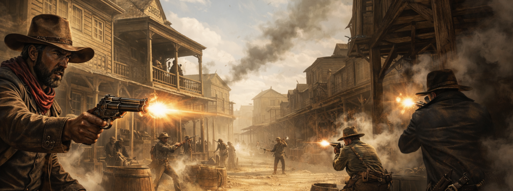

# **Cowboy-Shootout**

- ## status:

  - **`In development 🛠️`**
  - [x] Gun gesture tracking
  - [x] Two body detection - 14.12
  - [x] Bullet shot - 16.12
  - [x] Body segments - 17.12
  - [x] Game logic - 18.12
  - [x] Graphics and UI - 16.12 
  - [x] Sound-design - 20.12

- ## description

  - A camera-tracked game about wild west shootout between two cowboys.

  

  > You play against your opponent standing in front of you. When the second will say "SHOOT!" you should decide between two options:
  >
  > 1. Take a shot _(by aiming gun gesture to one of the segments of opponents body)_
  > 2. Protect yourself _(by aiming hand gesture to one of the segments of opponents body)_

  - Each cowboy body has 3 segments:

    - Head 🙂
    - Torso 👕
    - Legs 🦵

  - If you all choose gun, the fastest cowboy will win _(the other, unfortunatley loose 1 out of 3 hearts)_. If you all choose to protect - nothing will happen and the second round will begin.
    As you may notice you have 3 hearts (❤️❤️❤️). Loose all = loose a game.

- ## installation & use

  0. You need to have `Python` and `pip` installed
  1. Open terminal and run `git clone https://github.com/Viphase/cowboy-shootout.git && cd cowboy-shootout`
  2. Initialize venv `python -m venv .venv && source .venv/bin/activate`
  3. Install requirements using this command `pip install -r requirements.txt`
  4. Run main.py using `python main.py`
  5. Enjoy playing! 🌟

- ## examples
  ...
